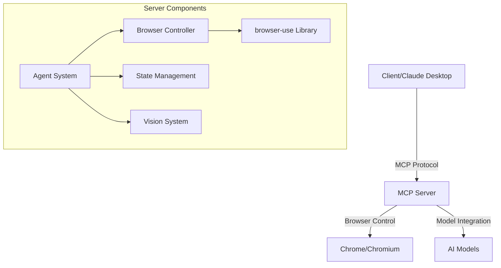
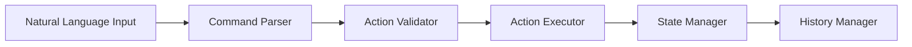
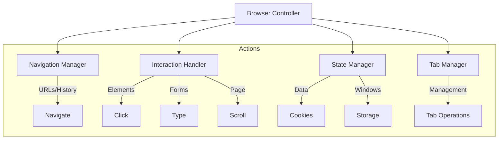
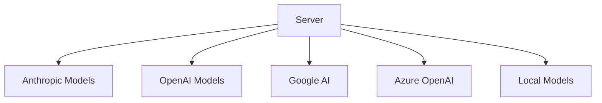

# System Patterns

## Architecture Overview

## Core Components

### 1. MCP Server Implementation
- Built using FastAPI and fastmcp framework
- Handles MCP protocol communication
- Manages tool and resource registration
- Processes client requests and responses

### 2. Agent System

**Key Patterns:**
- Command parsing and validation
- Action execution pipeline
- State persistence
- History management
- Vision integration

### 3. Browser Controller

### 4. Vision System
- Element detection using AI vision
- Screenshot analysis
- Visual element matching
- Context-aware interaction

## Design Patterns

### 1. Communication Patterns
- MCP protocol adherence
- Structured JSON responses
- Asynchronous operations
- Error handling middleware

### 2. State Management
- Browser session persistence
- Configuration state
- Agent memory/history
- Cookie/storage management

### 3. Security Patterns
- Environment-based configuration
- API key management
- Browser sandbox controls
- Secure communication channels

## Integration Patterns

### 1. Model Integration

### 2. Browser Integration
- Chrome DevTools Protocol
- Debugging port configuration
- User data management
- Session persistence

### 3. Library Integration
- browser-use library coupling
- FastAPI/fastmcp integration
- LangChain component usage
- Vision library integration

## Implementation Guidelines

### 1. Code Organization
- Modular component design
- Clear separation of concerns
- Consistent error handling
- Comprehensive logging

### 2. Configuration Management
- Environment variable usage
- Multiple provider support
- Flexible settings
- Secure secrets handling

### 3. Testing Patterns
- Unit test coverage
- Integration testing
- Browser automation testing
- Security validation

## Performance Patterns

### 1. Resource Management
- Browser session optimization
- Memory usage control
- Connection pooling
- Cache utilization

### 2. Scalability
- Asynchronous operations
- Resource limiting
- Load management
- Error recovery

### 3. Monitoring
- Performance metrics
- Error tracking
- Usage statistics
- Health checks
